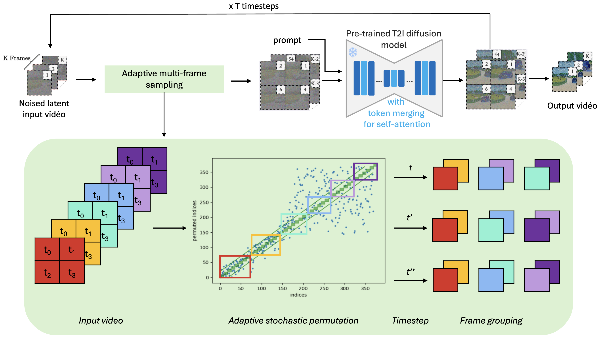

# AMAC: Adaptive Multi-frame sAmpling for Consistent zero-shot video editing

## Abstract
Ensuring a convincing temporal coherence is one of the main challenges in zero-shot video editing. To address this issue, this paper presents a new method called AMAC, that can achieve both temporal consistency and detail preservation. The method relies on an adaptive sampling strategy to select frames that are jointly processed using a pre-trained text-to-image diffusion model. By reformulating the sampling strategy as a stochastic permutation over the frame indexes and constructing its distribution according to inter-frame similarities, we promote the consistent processing of related content together. This method demonstrates better robustness against changes and shot transitions, and is particularly well suited to edit long dynamic video sequences, as shown through experiments on the DAVIS and BDD100K datasets.

## AMAC overview

## AMAC results
Here are shape and style editing on 36-frame and 90-frame DAVIS videos.
[
[
[

You can find more videos in *genrated_videos/* directory.
